# Java 101 Practice & Homeworks

## [Pratikler](https://github.com/batulaiko/java101_practice_homeworks/tree/main/practice)

### 1. [Not Ortalaması Hesaplayıcı](https://github.com/batulaiko/java101_practice_homeworks/tree/main/practice/temel_kavramlar_16)

Bu pratikte amaç If Else komutları olmadan sorgu yapıp buna uygun çıktı sunabilmektir.

Ödev içeriğinin bulunduğu [ders videosuna](https://app.patika.dev/moduller/java101/pratik-not-ortalamasi) tıklayarak ulaşım sağlanabilir.

Aşağıda ise elde edilen sonuç belirtilmektedir.

* Not Ortalaması Sınıfı Geçti

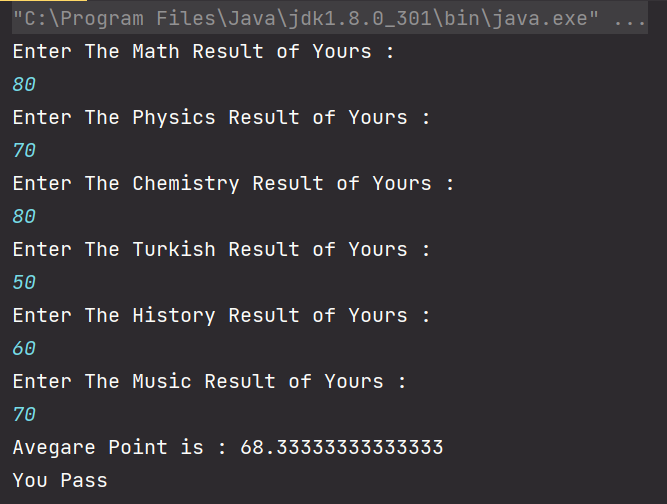

* Not Ortalaması Sınıfta Kaldı

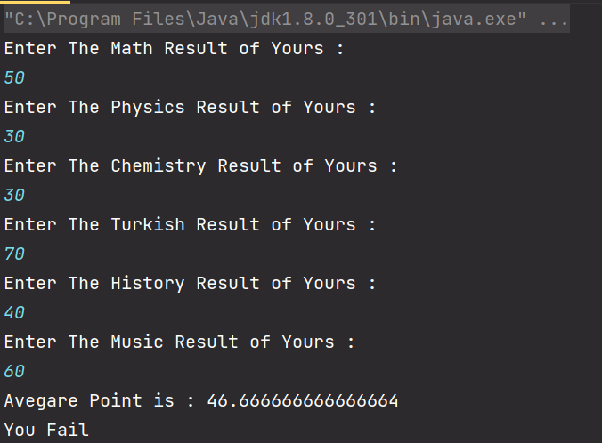

### 2. [KDV Hesaplama](https://github.com/batulaiko/java101_practice_homeworks/tree/main/practice/kdv_hesaplama)

Bu pratikte belli fiyat aralığına göre yüzdesel oranda KDV uygulanması ve bu uygulama sonucu çıktının yansıtılması hedeflenmektedir.

Ödev içeriğinin bulunduğu [ders videosuna](https://app.patika.dev/moduller/java101/pratik-kdv-hesaplama) tıklayarak ulaşım sağlanabilir.

Aşağıda ise elde edilen sonuç belirtilmektedir.

* KDV 1000 TL ve Altı

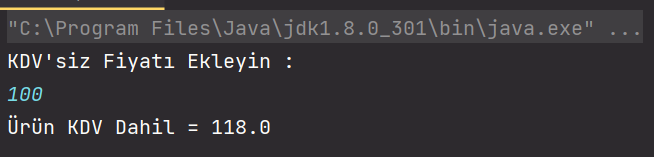

* KDV 1000 TL Üzeri

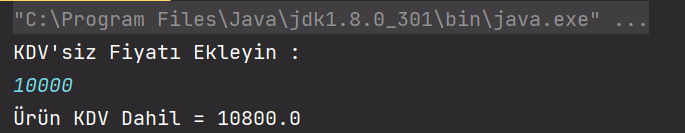 

### 3. [Üçgen Hipotenus / Alan Hesaplama](https://github.com/batulaiko/java101_practice_homeworks/tree/main/practice/dik_ucgen_hipotenus)

Bu pratikte bir üçgenin kenar bilgileri girilerek tercihe göre Alan ya da Hipotenüs bilgilerinin bulunması hedeflenmektedir.

Ödev içeriğinin bulunduğu [ders videosuna](https://app.patika.dev/moduller/java101/pratik-hipotenus-bulma) tıklayarak ulaşım sağlanabilir.

Aşağıda ise elde edilen sonuç belirtilmektedir.

* Çevre ve Alan

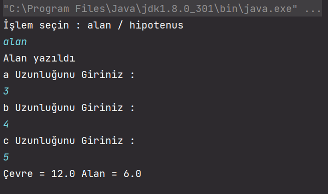

* Hipotenüs

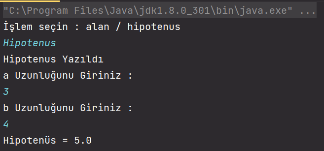 

### 4. [Taksimetre](https://github.com/batulaiko/java101_practice_homeworks/tree/main/practice/taksimetre)

Bu pratikte amaç belli ücretin altında ise sabit fiyat, değil ise kendi fiyatına sahip bir taksimetre uygulamasını gerçekleştirmektir.

Ödev içeriğinin bulunduğu [ders videosuna](https://app.patika.dev/moduller/java101/pratik-taksimetre) tıklayarak ulaşım sağlanabilir.

Aşağıda ise elde edilen sonuç belirtilmektedir.

* 20 TL ve Altı

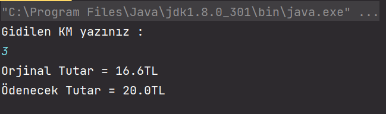

* 20 TL Üzeri

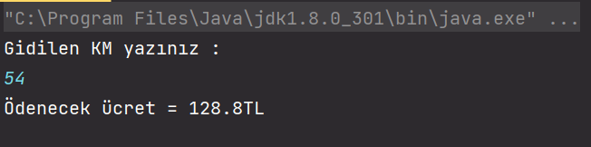

### 5. [Daire Çevre, Alan, Taralı Alan Hesaplama](https://github.com/batulaiko/java101_practice_homeworks/tree/main/practice/daire_cevre_alan)

Bu pratikte yarıçapı ve merkez açısı belirli bir dairenin çevresi, alanı ve taralı alanının bulunması gerçekleştirilmiştir.

Ödev içeriğinin bulunduğu [ders videosuna](https://app.patika.dev/moduller/java101/pratik-daire-alan-cevre) tıklayarak ulaşım sağlanabilir.

Aşağıda ise elde edilen sonuç belirtilmektedir.

* Yarı Çapı 5cm, Merkez Açısı 300 Derece

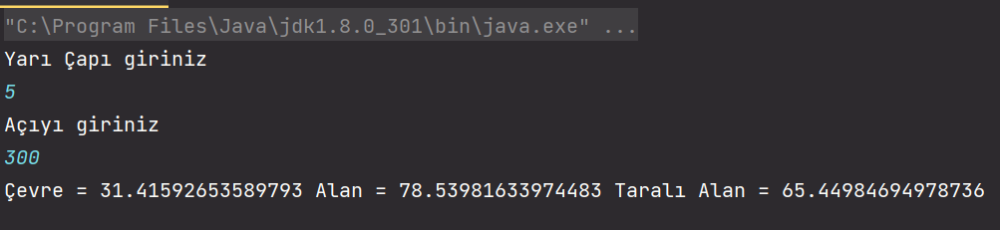

### 6. [Hesap Makinesi](https://github.com/batulaiko/java101_practice_homeworks/tree/main/practice/hesap_makinesi)

Bu pratikte önce sayıları daha sonra yapılacak işlemi belirleyerek sonucu çıktı olarak sunulması hedeflenmiştir.

Ödev içeriğinin bulunduğu [ders videosuna](https://app.patika.dev/moduller/java101/pratik-hesap-mak-1) tıklayarak ulaşım sağlanabilir.

Aşağıda ise elde edilen sonuç belirtilmektedir.

*Çarpma İşlemi

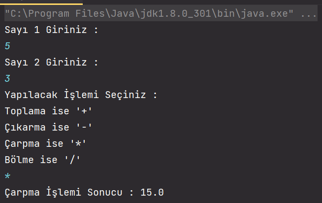

*Toplama İşlemi

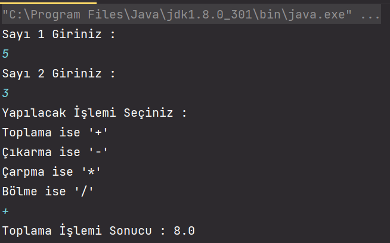

## Ödevler

### 1. [Kilo Boy Endeks Ölçümü](https://github.com/batulaiko/java101_practice_homeworks/tree/main/homeworks/kilo_boy)

Bu ödevde, verilen boy ve kilo oranına göre vücut endeksi sonucu ve kilo oranı çıktı olarak sunulması hedeflenmiştir.

Ödev içeriğinin bulunduğu [ders videosuna](https://app.patika.dev/moduller/java101/odev-vucut-kitle-hesaplama) tıklayarak ulaşım sağlanabilir.

Aşağıda ise elde edilen sonuç belirtilmektedir.

* Normal Kilolu Birey 

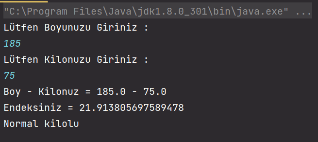

* Fazla Kilolu Birey

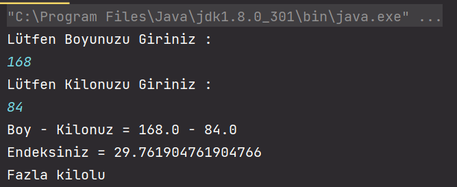

### 2 [Manav Kasa Programı](https://github.com/batulaiko/java101_practice_homeworks/tree/main/homeworks/manav_kasa)

Bu ödevde, verilen meyve sebzenin kilo başına  düşen fiyatı ile toplam manav alışverişinin hesaplanması amaçlanmıştır.

Ödev içeriğinin bulunduğu [ders videosuna](https://app.patika.dev/moduller/java101/odev-manav-kasa) tıklayarak ulaşım sağlanabilir.

Aşağıda ise elde edilen sonuç belirtilmektedir.

* Hesaplama Sonucu

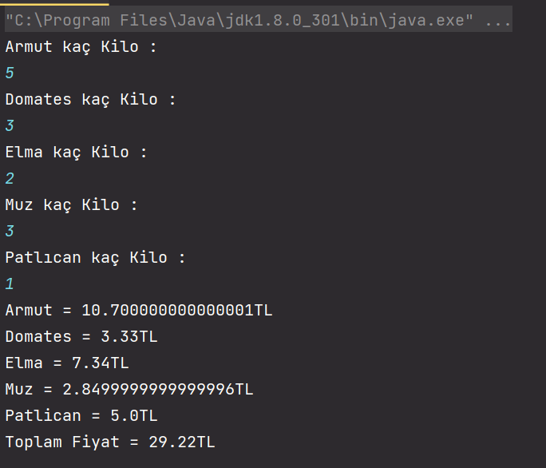

