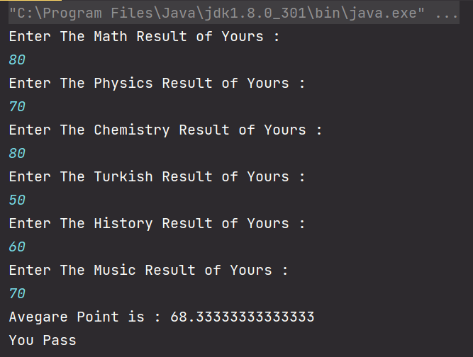
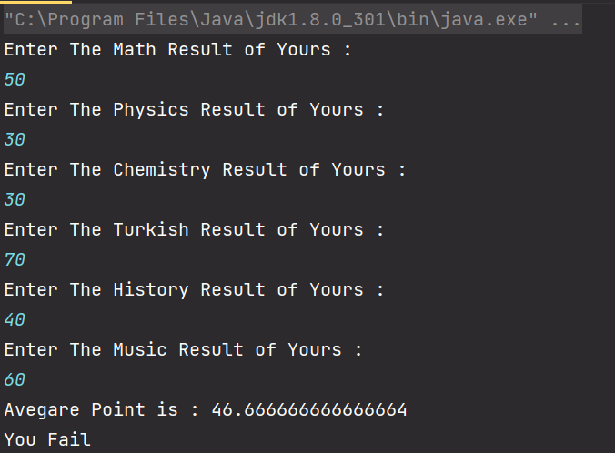
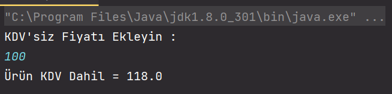
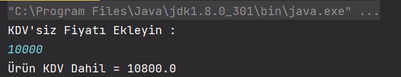
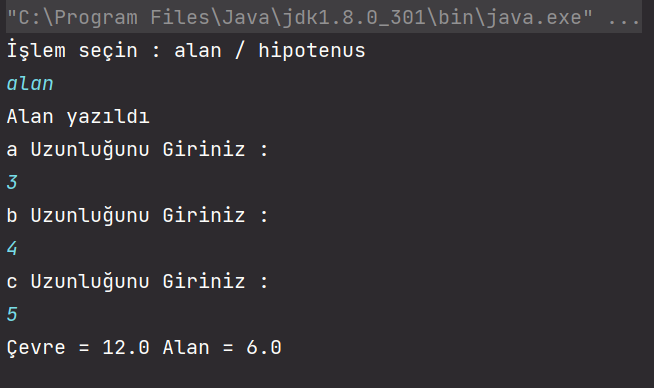
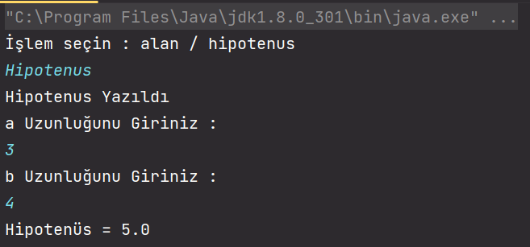

# Java 101 Practice & Homeworks

## 1. Temel Kavramlar (Not Ortalaması Hesaplayıcı)

Bu pratikte amaç If Else komutları olmadan sorgu yapıp buna uygun çıktı sunabilmektir.

Ödev içeriğinin bulunduğu [ders videosuna](https://app.patika.dev/moduller/java101/pratik-not-ortalamasi) tıklayarak ulaşım sağlanabilir.

Aşağıda ise elde edilen sonuç belirtilmektedir.

* Not Ortalaması Sınıfı Geçti

* Not Ortalaması Sınıfta Kaldı

## 2. KDV Hesaplama

Bu pratikte belli fiyat aralığına göre yüzdesel oranda KDV uygulanması ve bu uygulama sonucu çıktının yansıtılması hedeflenmektedir.

Ödev içeriğinin bulunduğu [ders videosuna](https://app.patika.dev/moduller/java101/pratik-kdv-hesaplama) tıklayarak ulaşım sağlanabilir.

Aşağıda ise elde edilen sonuç belirtilmektedir.

* KDV 1000 TL ve Altı

* KDV 1000 TL Üzeri

 

## 3. Üçgen Hipotenus / Alan Hesaplama

Bu pratikte bir üçgenin kenar bilgileri girilerek tercihe göre Alan ya da Hipotenüs bilgilerinin bulunması hedeflenmektedir.

Ödev içeriğinin bulunduğu [ders videosuna](https://app.patika.dev/moduller/java101/pratik-hipotenus-bulma) tıklayarak ulaşım sağlanabilir.

Aşağıda ise elde edilen sonuç belirtilmektedir.

* Çevre ve Alan

* Hipotenüs

 